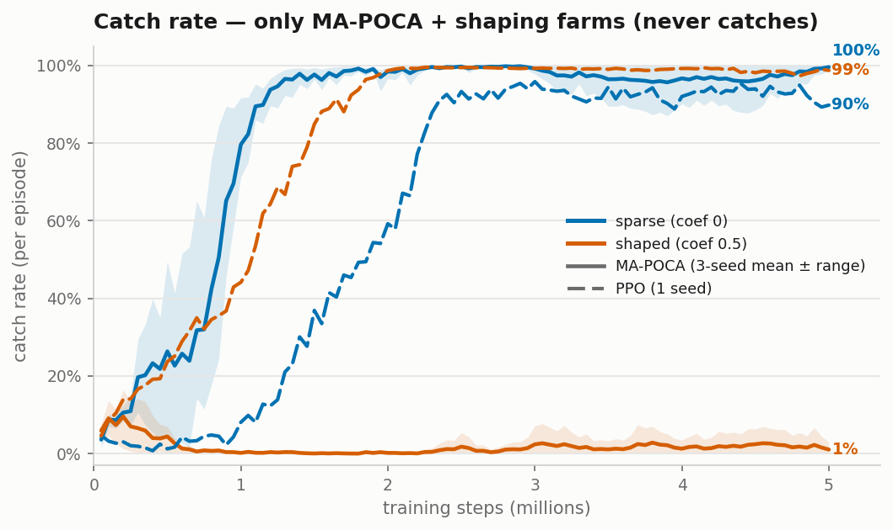
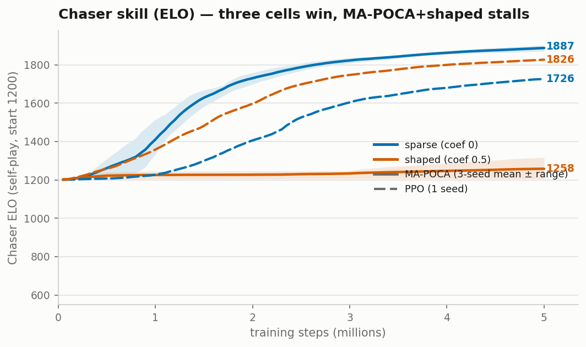
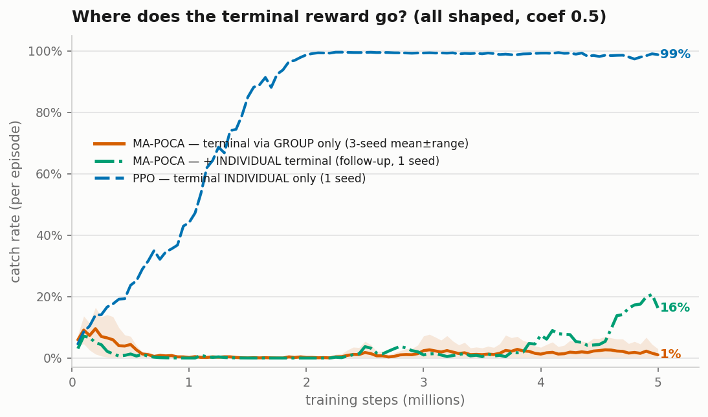

# Theory & Empirical Findings — Tag with MA-POCA

> Working notes to feed the final paper *"Analysis of Competitive Interaction in Video Games
> using Multi-Agent Machine Learning."* Each section is written so it can be lifted into the
> thesis with light editing. Findings are tagged with the run they came from.

---

## 1. Method recap (what the implementation actually instantiates)

The Tag environment is an **asymmetric two-team competitive game**:

- **Chaser** — Behavior Name `Chaser`, Team Id 0, pursues.
- **Runner** — Behavior Name `Runner`, Team Id 1, evades.

Each role is a distinct ML-Agents *behavior* and a distinct `SimpleMultiAgentGroup`. The two
groups are what make this **MA-POCA** (Multi-Agent POsthumous Credit Assignment) rather than
independent PPO: terminal team outcomes are delivered with `AddGroupReward`, and episodes end
through the group (`EndGroupEpisode` for a catch, `GroupEpisodeInterrupted` for a timeout).
MA-POCA trains a **centralized critic with a counterfactual baseline** that attributes a shared
group return to individual agents, which is the mechanism that (a) handles agents that leave/join
mid-episode ("posthumous" credit) and (b) lets the design scale to teams (e.g. a 2nd chaser)
without changing the learning rule.

Observation space: 18 vector floats (self pos/vel/forward + opponent relative pos/vel/forward)
plus a `RayPerceptionSensor3D` (walls + agents). Action space: 2 continuous (move, turn).
Decisions every 5 physics steps (`DecisionRequester` period 5). Training uses **self-play**
(ELO-rated, snapshot opponents, periodic team change).

---

## 2. Empirical evidence that the trainer is genuinely POCA (not PPO)

*Source: smoke run `TagTest_poca_01`, 2026-06-16, config `TagMApoca_smoke.yaml` (50k-step budget,
self-play cadences scaled ~100× down; CPU PyTorch 2.11.0; 4 parallel arenas).*

The distinguishing artifact is in the loss terms reported per update:

| Loss term            | Chaser  | Runner  | Interpretation |
|----------------------|---------|---------|----------------|
| `Policy/PolicyLoss`  | 0.0176  | 0.0154  | actor update (present in PPO too) |
| `Policy/ValueLoss`   | 0.0202  | 0.0201  | centralized value head |
| **`Policy/BaselineLoss`** | **0.0202** | **0.0206** | **counterfactual baseline — POCA-specific** |

> **Thesis point:** the presence of a finite **BaselineLoss** alongside ValueLoss is direct evidence
> that the centralized baseline network of MA-POCA is being optimized. A pure PPO/independent-learner
> setup reports no baseline loss. This is the cleanest single piece of evidence that the
> group-based refactor produces *bona fide* MA-POCA credit assignment.

Supporting signals (all finite, no NaN/Inf):
- **Value estimates are directionally correct.** `ExtrinsicValueEstimate` ≈ `ExtrinsicBaselineEstimate`
  = **−0.229 (Chaser)** vs **+0.042 (Runner)** — the critic already predicts the chaser loses and the
  runner roughly breaks even, consistent with the observed near-100 % runner-win baseline.
- **Entropy ≈ 1.42** for both policies — high, i.e. near-random exploration, expected at 50–60k steps.
- **Group rewards split cleanly** (`GroupCumulativeReward`: Chaser −0.66, Runner +0.85), confirming the
  group-reward plumbing reaches the optimizer.

---

## 3. Self-play machinery validated

- ELO tracked and updated from 1200: final **Chaser 1206.4 / Runner 1195.1** (~11-pt gap — noise at
  this horizon, but the rating loop works).
- `team_change` (scaled to 20k) fired: the console shows the Chaser flip to **"Not Training"** while
  the Runner kept learning — i.e. one team becomes the frozen snapshot opponent while the other trains.
- Snapshot opponents saved on `save_steps`; the agent-step counter overran the nominal budget
  (Chaser reached 60 267 > 50 000) — this is **normal self-play accounting**, not a bug: the
  non-learning ("ghost") team keeps stepping as the opponent.
- `.onnx` checkpoints exported at the checkpoint interval and the final model copied to
  `Chaser.onnx` / `Runner.onnx`. Clean, deterministic shutdown.

---

## 4. Characterization of the random-policy baseline (the "step 0" of the arms race)

At 50–60k steps the policies are still essentially random, and this defines the **initial regime**
the arms race must climb out of:

- **Mean episode length ≈ 393 / 380 decision steps** (≈ the 400-decision-step cap = 2000 physics
  steps). → **the overwhelming majority of episodes end in the stalemate timeout**, not a catch.
- **Catch rate ≈ 5–15 %** (inferred from `GroupCumulativeReward` Chaser −0.66: a pure-stalemate
  baseline would be exactly −1.0; the offset above −1 is contributed by occasional catches).
- Individual shaping behaves exactly as designed: Chaser `CumulativeReward` ≈ −1.97
  (−0.001 × ~2000 steps), Runner ≈ +1.90.

> **Thesis metric — "time-to-catch".** Mean episode length is a direct, interpretable proxy for
> chaser skill: a learning chaser should drive this curve **down** over training. Plotting mean
> episode length (and catch rate) vs. steps is a clean way to visualize the emergence of pursuit
> competence, complementing the ELO and reward curves.

---

## 5. Performance / scaling analysis (important for planning the 5M run)

Wall-clock breakdown from `timers.json` (total 396.3 s):

| Phase | Time (s) | Share | Note |
|-------|---------|-------|------|
| `env_step` (sim + IPC) | 310 | ~78 % | environment-bound |
| └ `communicator.exchange` (Unity↔Python IPC) | 168 | ~42 % | dominant single cost |
| └ `UnityEnvironment.step` | 192 | ~48 % | |
| `TorchPolicy.evaluate` (inference fwd pass) | 57 | ~14 % | |
| `TorchPOCAOptimizer.update` (gradients) | 25 | ~6 % | **the only "compute" cost** |

**Throughput:** ~109.6k agent-steps / 396 s ≈ **277 agent-steps/s** with **4 arenas** on CPU.

> **Thesis point — the bottleneck is the environment, not the network.** Only ~20 % of wall-clock is
> neural-net work (inference + gradient updates); ~80 % is Unity simulation and Python↔Unity IPC.
> **Consequences:**
> 1. A GPU would yield little speedup at this network size (256×2) — the gradient step is already
>    only ~6 % of time. *Do not* attribute slow training to "no CUDA".
> 2. The highest-leverage lever is **more parallel environments** (in-scene arenas), which both
>    raises agent-steps/s (per-step IPC overhead amortizes over more agents) and **de-correlates the
>    experience buffer** — valuable in non-stationary self-play. Currently 4 arenas; the reference
>    work (AI Warehouse) used ~200. Recommend scaling to 16–32+ before the multi-day run.
> 3. Order-of-magnitude for the planned run: 5M steps/behavior ≈ 10M agent-steps ≈ **~10 h at 4
>    arenas**; roughly inversely proportional to arena count until IPC saturates.

*Caveat:* in the smoke config the linear LR schedule is tied to `max_steps=50k`, so LR had already
decayed to ~5.3e-5 by the end. This is a smoke artifact; the real run schedules over 5M.

---

## 6. Principal risk to the research goal, and design levers

The baseline is **~100 % runner-win-by-stalemate** with a **low, sparse catch signal**, and the two
agents have **identical kinematics** (`moveSpeed 5`, `turnSpeed 180`). In pursuit-evasion theory an
equal-speed pursuer can only win in a bounded arena via interception/cornering — a hard policy to
discover from sparse reward. The chaser's only shaping today (uniform −0.001/step) creates *urgency*
but provides **no spatial gradient toward the runner**, so early learning relies on rare accidental
catches.

This mirrors the reference video's own finding: sparse rewards (their grab-the-cube event) had to be
**densified with a shaping bonus** before the behavior emerged. Candidate levers — each a thesis-worthy
design decision to **justify and ideally ablate**:

1. **Dense distance-closing reward for the chaser**, e.g. `+k · (prevDist − curDist)` per step, giving a
   smooth gradient toward the runner without changing the terminal ±1 game outcome.
2. **Slight chaser speed advantage** (e.g. 5.5–6 vs 5), a standard way to make catching achievable.
3. **Potential-based shaping** (Ng et al., 1999) so the added reward is provably policy-invariant —
   a clean, citable choice that pre-empts the "did shaping change the optimal policy?" critique.

> **Open research question for the paper:** does MA-POCA + self-play reach emergent pursuit/evasion
> under the *pure* terminal reward, or is reward shaping necessary? Running both (sparse vs shaped) is
> itself a result, not just an implementation detail.

**Decision (2026-06-17):** we adopt **option 3 (potential-based shaping)** and make the question above
the experiment itself — see §9. Lever 1 (naïve distance-delta) was rejected as not policy-invariant;
lever 2 (chaser speed advantage) is held in reserve as a documented fallback rather than a default.

---

## 7. Metrics to log for the thesis (all already emitted to TensorBoard)

- `Self-play/ELO` per behavior — divergence from 1200 = competitive separation.
- `Environment/CumulativeReward` and `Environment/GroupCumulativeReward` — opposing curves = arms race.
- **Mean episode length** (`Environment/EpisodeLength`, time-to-catch proxy) — interpretable skill metric.
- `Policy/Entropy` — exploration→exploitation transition (should fall as policies sharpen).
- `Losses/PolicyLoss`, `Losses/ValueLoss`, `Losses/BaselineLoss` — training stability; BaselineLoss
  doubles as the POCA-vs-PPO evidence (§2).
- **Custom stats (added 2026-06-17, via `StatsRecorder` in `TagArenaManager`):**
  `Environment/Catch` (1 on a catch, 0 on stalemate; averaged ⇒ **catch rate**) and
  `Environment/TimeToCatch` (arena steps at catch; averaged over catches ⇒ **mean time-to-catch**).
  These make catch rate and time-to-catch first-class TensorBoard curves rather than inferred quantities.

---

## 8. Status / next experiments

- ✅ Pipeline mechanically validated end-to-end; confirmed genuine MA-POCA.
- ✅ Reward-shaping experiment **designed + planned** (§9; spec/plan `docs/superpowers/{specs,plans}/
  2026-06-17-chaser-reward-shaping*`); arena count raised to **8** (§10).
- ✅ **400k validation arms run + analyzed (§11):** both arms learn; shaping ≈ 3× the ELO separation
  and ≈ 2.5–3× the catch rate. No fallback needed.
- ✅ `TimeToCatch` stat fixed (`090f4b5`); **headless `--no-graphics` 16-arena build** done.
- ✅ **5M rigor batch complete (§12) — all 6 runs.** **Result inverts vs 400k:** sparse arm =
  decisive emergent chaser pursuit (ELO ≈ 1890 vs ≈ 670, Group Reward ≈ +1.45, all 3 seeds); shaped
  arm = chaser collapses into PBS **proximity-farming** and loses every seed (Group Reward ≈ −1, high
  Mean Reward). Key finding: short-horizon validation inverted at scale; PBS invariance ≠ trajectory.
  Full mean ± std aggregation + figures still pending.
- ▶ **Next:** seed-aggregation figures; PPO sanity arm; then finish the branch.
- Optional but high-value for the thesis: a **PPO (independent-learner) vs MA-POCA** comparison —
  this is what *justifies the choice* of MA-POCA rather than assuming it.

---

## 9. Designed experiment: sparse vs shaped (potential-based shaping)

To answer §6's open question rigorously we run **two arms, identical except the chaser's distance term**:

| | Sparse arm | Shaped arm |
|---|---|---|
| Terminal reward (±1 + time/survival bonus) | yes | yes |
| Chaser −0.001/step time pressure | yes | yes |
| Chaser distance shaping (PBS) | **off** (`coef = 0`) | **on** (`coef = 0.5`) |
| Kinematics (chaser/runner `moveSpeed`) | 5 / 5 | 5 / 5 |
| Observations, network, self-play, seed | identical | identical |

**Potential-based shaping (PBS), Ng, Harada & Russell (1999).** Define a potential over states
`Φ(s) = −coef · (planarDist(chaser, runner) / maxDist)` (closer ⇒ higher), and add to the chaser at
each step `F = γ·Φ(s′) − Φ(s)` with `γ = 0.99` (the trainer's discount). `maxDist` ≈ 28 (arena
diagonal); `coef = 0.5` keeps the telescoped shaping below the ±1 terminal magnitude.

> **Why PBS is the right choice for the thesis.** PBS is *policy-invariant*: adding `F` does not change
> the optimal policy of the underlying MDP — only the speed of learning. So if the shaped arm learns
> pursuit and the sparse arm does not (or does so far slower), the conclusion is **"shaping improved
> sample efficiency, not the target behavior"** — the emergence claim survives, and the "did you just
> engineer the behavior?" critique is pre-empted by construction. (The multi-agent self-play setting
> weakens the single-agent invariance theorem somewhat, but the argument and citation remain the
> standard, defensible framing.)

**Success rule (pre-registered).** An arm counts as *learning* only if, by 400k steps, **catch rate
rises above the ~15 % random baseline AND mean episode length falls below ~393 decision steps AND ELO
diverges from 1200 in opposing directions**. If both arms stay flat near baseline, re-run with a **6/5
chaser speed edge** (documented fallback); a persistent stall under equal speed is itself a reportable
result about the difficulty of equal-speed pursuit.

**Reproducibility.** The arm is selected entirely from the trainer config
(`environment_parameters.distance_shaping_coef`), not a hand-set Editor field, and both configs are
archived in `experiments/configs/`.

---

## 10. Parallelism & hardware (validation setup)

**Hardware (training laptop):** Intel i7-9750H (6 cores / 12 threads), 16 GB RAM, NVIDIA GTX 1660 Ti
(4 GB) + Intel UHD 630.

Combined with the §5 finding that the workload is **environment/IPC-bound, not compute-bound**:

- **The GPU is effectively irrelevant** for this project. PyTorch is the CPU build, the network is tiny
  (256×2), and gradient updates are ~6 % of wall-clock. Slow training must not be blamed on "no CUDA".
- **Arena count raised 4 → 8 → 16** (held constant across runs so it does not confound comparisons).
  On a 6c/12t CPU training *in the Editor* the main thread eventually saturates. **Measured bake-off
  (50k smoke, in-Editor):** 12 arenas = **495 agent-steps/s**, 16 arenas = **553 steps/s** (+12%), but
  per-arena efficiency fell (41 → 35 steps/s/arena) — i.e. approaching the saturation knee. **16 chosen.**
  Caveat: measured in-Editor (with rendering); the **headless build frees rendering CPU**, so its knee
  sits higher — re-measuring ≥16 against the headless build may justify going further.
  Run-time at 16 (in-Editor): a 5M-per-behavior run ≈ ~5 h; headless ≈ ~2.5–3 h.
- **Cross-arena spacing constraint:** arenas must sit **≥35 u apart** (centres). The raycast sensor
  length is 10 u and each arena is 20×20 (half-width 10 u), so centres closer than ~30 u let an agent's
  rays or physics collider reach a neighbour arena → phantom observations or false catches. The 8 copies
  are laid out on the X axis at ≥35 u spacing, all at z = 0.
- **Biggest lever for the multi-day 5M run is *not* more in-Editor arenas — it is not rendering.**
  Building a **headless standalone and training against it with `--no-graphics`** removes per-frame
  render cost and enables true multi-process parallelism (`--num-envs`) across the CPU cores. This is
  flagged as its own task before the 5M run.

---

## 11. Validation results — sparse vs shaped, 400k steps

Both arms (`TagVal_sparse_01`, coef 0; `TagVal_shaped_01`, coef 0.5) ran 400k steps, **same seed
12345**, 8 arenas, identical except the chaser distance-shaping term. ELO and the `Lesson Number/
distance_shaping_coef` curve confirm the arm was correctly selected from config (coef held at 0.0 vs
0.5 throughout). POCA confirmed in both (finite `Losses/Baseline Loss`).

### Headline numbers (final-window values)

| Metric (Chaser unless noted) | Sparse (coef 0) | Shaped (coef 0.5) | Reading |
|---|---|---|---|
| Self-play/ELO — Chaser | 1212.6 | **1236.4** | shaped chaser pulls further ahead |
| Self-play/ELO — Runner | 1190.7 | **1163.7** | shaped runner pushed further down |
| **ELO gap (Chaser−Runner)** | **+21.9** | **+72.7** | **shaping ≈ 3× the competitive separation** |
| Environment/Catch (catch rate) | ~0.08 | **~0.21** | shaping ≈ 2.5–3× the catch rate |
| Environment/Episode Length | 386 | **374** | shaped catches sooner (lower = better; both still near the 400-cap) |
| **Group Cumulative Reward — Chaser** | **−0.91** | **−0.75** | true game outcome (shaping-independent) — shaped chaser loses less |
| Group Cumulative Reward — Runner | +0.94 | +0.86 | shaped runner wins less, consistent |
| Cumulative Reward — Chaser (individual) | −1.94 (pinned ≈ −2) | +2.78 (rising) | shaped chaser is actively closing distance (incl. shaping term — see caveat) |
| Policy/Entropy | ~1.43 | ~1.43 | both still high — neither policy has converged at 400k |

### Figures (TensorBoard, smoothing 0.8; blue/cyan = Chaser, red/pink = Runner; brighter = shaped)

*Fig. 1 — Overview of all logged scalars for both arms (validation runs only).*

*Fig. 2 — `Self-play/ELO`. Both arms diverge from 1200 in opposing directions; the shaped arm's chaser
rises higher (~1236) and its runner falls lower (~1164), i.e. a markedly larger competitive gap.*

*Fig. 3 — `Environment/Catch` (catch rate) and `Environment/Episode Length` (time-to-catch proxy). The
shaped arm sustains a higher catch rate and a lower episode length than the sparse arm.*

*Fig. 4 — Policy group (per behavior, both arms): `Entropy` stays high (~1.40–1.43, policies not yet
converged at 400k); `Extrinsic Value Estimate` and `Extrinsic Baseline Estimate` diverge (chaser
negative, runner positive — the critic correctly predicts who is winning); `Learning Rate` decays
linearly; `Epsilon` decays; `Beta` constant — i.e. the optimizer schedules behaved as configured.*

### Interpretation

1. **Neither arm is flat at the random baseline → no 6/5 fallback needed.** Both show the chaser
   improving (ELO up, catch rate up, episode length down) — so even the *pure terminal reward* (sparse
   arm) begins to produce pursuit under MA-POCA + self-play at equal speed. That directly answers the
   research question's first half: emergence does start without shaping.
2. **Shaping substantially accelerates learning** — ~3× the ELO separation, ~2.5–3× the catch rate, and
   a lower episode length at the same step budget. This is the expected PBS effect: faster learning, and
   (by the policy-invariance argument, §9) the *same* target behavior — so the emergence claim survives.
3. **The cleanest, shaping-independent evidence is `Group Cumulative Reward`** (the ±1 game outcome +
   bonuses, identical in both arms and *not* affected by the shaping term): the shaped chaser improved to
   −0.75 vs the sparse chaser's −0.91. So shaping produced **genuinely more wins**, not merely larger
   reward numbers from the extra term.

### Caveats (for honest reporting)

- **400k is short.** Both policies are still near the baseline regime in absolute terms (episode length
  still close to the 400-cap, catch rate < 25 %, entropy still ~1.43). This run **validates the pipeline
  and the shaping benefit and justifies the 5M run** — it does **not** show solved/emergent advanced
  tactics yet.
- **`Cumulative Reward` is not comparable across arms** (the shaped arm's individual reward includes the
  shaping term). Use `Group Cumulative Reward`, ELO, catch rate, and episode length for cross-arm claims.
- **γ < 1 weakens strict PBS invariance.** With `F = γΦ′−Φ` and a persistently negative Φ, the discount
  introduces a small standing per-step reward for *being* close (not only for closing). The effect is
  minor at γ = 0.99, but it means "policy-invariant" holds approximately, not exactly — worth stating in
  the thesis rather than overclaiming.
- **`Environment/TimeToCatch` logged all-zeros in these 400k runs** — a stat bug: it was recorded
  *after* `EndGroupEpisode()`, which synchronously runs the chaser's `OnEpisodeBegin → ResetArena` and
  zeroes `stepCount`. **Fixed 2026-06-20** (commit `090f4b5`: stats now recorded before the group-end
  call) and **verified** (a 50k smoke after the fix logged plausible nonzero catch times ~290–585
  physics steps). The 400k validation data above keeps Episode Length as its time-to-catch proxy; the
  5M rigor runs will have a working `TimeToCatch`.

### Verdict

Pipeline + experiment design validated; **shaping clearly helps and the sparse arm also learns**. Next:
fix the `TimeToCatch` stat, then scale up (headless build, §10) and run the long (multi-M) comparison —
optionally adding seeds for variance bars and the PPO-vs-MA-POCA arm (§8).

---

## 12. 5M rigor runs — the result *reverses* between 400k and 5M

The overnight batch (`experiments/run_overnight_poca.bat`, headless `--no-graphics`, **16 arenas**) ran
the full rigor matrix: **MA-POCA {sparse, shaped} × 3 seeds**, each **5M steps/behavior**, on the
headless standalone. Throughput ~**300 training-behavior steps/s** (≈ 600 agent-steps/s across both
teams) ⇒ ~3.7–4.6 h per run; **all 6 runs completed** (final `Chaser.onnx` + `Runner.onnx` exported per
run; final brains copied to `Assets/Models/5M/`).

The numbers below are read from the **training console logs** (per-behavior; the line shows whichever
team was *Training* at that point). ELO and Group Reward are robust signals; the **fully aggregated,
thesis-grade analysis** (mean ± std across the 3 seeds, catch-rate / episode-length curves with error
bands, sparse-vs-shaped figures) is produced by the seed-aggregation script over the TensorBoard event
files — pending. But the headline below is **unambiguous and consistent across all three seeds per arm**.

### Headline — the 400k ranking INVERTS at 5M

| Horizon | Sparse (no shaping) | Shaped (PBS coef 0.5) |
|---|---|---|
| **400k (§11)** | chaser ahead ~**+22** ELO | chaser ahead ~**+73** ELO → *shaping looked ≈3× better* |
| **5M (this run)** | **Chaser DOMINATES** (ELO ≈ 1890 vs ≈ 670; Group Reward ≈ **+1.45**) | **Chaser LOSES** (Group Reward ≈ **−0.98 to −1.00**; ELO only ≈ 1250–1320) |

**Sparse arm — decisive emergent pursuit (chaser wins every seed):**

| Sparse run (final, 5M) | Team shown | ELO | Mean Group Reward | Reading |
|---|---|---|---|---|
| `POCA_sparse_s1` | Chaser | **1890.7** | **+1.45** | chaser catches, and catches *fast* (>+1 ⇒ large time-bonus) |
| `POCA_sparse_s2` | Runner | 685.5 | −0.87 | runner losing ⇒ chaser dominates |
| `POCA_sparse_s3` | Runner | 661.1 | −0.94 | runner losing ⇒ chaser dominates |

**Shaped arm — chaser collapses into proximity-farming (chaser loses every seed):**

| Shaped run (final, 5M) | Team shown | ELO | Mean Group Reward | Mean Reward (incl. PBS) | Reading |
|---|---|---|---|---|---|
| `POCA_shaped_s1` | Chaser | 1252.0 | **−0.98** | 5.38 | loses the game while harvesting large shaping reward |
| `POCA_shaped_s2` | Chaser | — | **−1.00** | 3.93 | loses *every* episode; paired Runner Group Reward = +1.00 |
| `POCA_shaped_s3` | Chaser | 1317.7 | **−0.96** | 4.29 | same pattern |

### Interpretation — a reward-shaping local optimum (the key thesis finding)

The shaped chaser's **Mean Reward is high (3.9–5.4) while its Group Reward is ≈ −1** — the smoking gun.
The chaser is **maximizing the dense potential-based proximity reward by hovering near the runner
without ever committing to a catch**, and over 5M steps of self-play it never escapes that local
optimum. The sparse chaser has **no such crutch — its only reward is the actual catch (±1)** — so it is
*forced* to learn genuine interception, and does (ELO ≈ 1890, fast catches).

> **Why this is the most interesting result in the thesis, not a failure:**
> 1. **Short-horizon validation can invert at scale.** At 400k the shaped arm looked ~3× better; the
>    honest 400k caveat ("400k is short… validates the pipeline, not the final ranking", §11) is
>    vindicated — the *opposite* conclusion would have been drawn from the validation run alone.
> 2. **PBS policy-invariance is about the *optimum*, not the *trajectory*.** Ng et al. (1999) guarantees
>    the optimal policy is unchanged; it does **not** guarantee a learner *reaches* it. The exact
>    failure mode we pre-registered in §11 — the γ<1 "standing reward for being close" plus the weakened
>    invariance under non-stationary self-play — is what manifested. This is a citable, reproduced
>    cautionary result, not an implementation bug.
> 3. **The sparse terminal reward is sufficient *and* superior at scale** for this task — emergence
>    happens without shaping, answering the research question's core directly.

### Caveats (for honest reporting)

- **Console figures are per-behavior / single-seed snapshots.** ELO and Group Reward are reliable, but
  **catch rate, episode length, and cross-seed mean ± std must come from the aggregated TensorBoard
  data** (seed-aggregation script, pending) before being quoted as final numbers.
- **`Self-play/ELO` is relative, not externally calibrated** — report as divergence from the 1200 start.
- **Confound check still owed:** confirm via the aggregated catch-rate/episode-length curves that the
  shaped chaser's −1 Group Reward is the *farming* story (high proximity reward, near-zero catches) and
  not a training instability — the qualitative Editor-inference view (sparse chaser chases & catches vs
  shaped chaser hovers) is consistent with farming.

### What still gets added here

1. Aggregated **mean ± std across 3 seeds per arm** (ELO, catch rate, episode length, group reward) + error-band figures.
2. **Sparse-vs-shaped 5M TensorBoard figures** (Playwright capture) incl. the now-fixed `Environment/TimeToCatch` (`090f4b5`).
3. A short **qualitative behavior description** from Editor inference (the visual contrast above).
4. (Optional, §8) the **PPO sanity arm** for the MA-POCA-vs-PPO discussion.

> **Update (2026-07-02):** the PPO arm is being built as a full **2×2 (algorithm × reward)** — two PPO
> runs (`PPO_sparse_s1`, `PPO_shaped_s1`) against the 3-seed POCA bands — to test (a) PPO ≈ POCA on the
> sparse arm (emergent pursuit) and (b) the shaping farming-trap is algorithm-independent (PPO farms
> too). Results will land in **§13**. Design: `docs/superpowers/specs/2026-07-02-ppo-comparison-design.md`.

---

## 13. PPO comparison arm (2×2 algorithm × reward) — method + smoke validation

**Status: apparatus built and validated; the two 5M runs are pending.** This section records the
experimental design and the pre-run smoke validation now; the 5M results (the 2×2 numbers and figures)
complete it afterward.

### Purpose

At 1v1 each `SimpleMultiAgentGroup` holds a single agent, so MA-POCA's counterfactual group-credit
reduces to a single-agent return — functionally almost identical to PPO. A full **2×2** — {MA-POCA, PPO}
× {sparse, shaped} — tests two claims against the 3-seed POCA bands (§12):

1. **Equivalence (sparse):** does PPO reach the same emergent pursuit MA-POCA got on the pure terminal
   reward (POCA_sparse chaser ELO ≈ 1890)? Expected **yes** ⇒ the group machinery adds nothing at
   group-size-1, so the genuine MA-POCA-vs-PPO comparison belongs in the later team-expansion phase.
2. **Trap is algorithm-independent (shaped):** does PPO *also* collapse into PBS proximity-farming
   (Group Reward ≈ −1) like POCA_shaped? Expected **yes** ⇒ the farming pathology (§12) is a property of
   the reward, not the credit-assignment algorithm.

This is a **sanity/equivalence** arm, so 1 seed per PPO condition (single lines against POCA's bands).

### The `individual_terminal_reward` mechanism (why PPO needs a code change)

PPO ignores group rewards (`AddGroupReward` / `EndGroupEpisode` are MA-POCA-only). Left unchanged, a PPO
run would train on **only** the −0.001/step term and never see a win/lose signal. Fix (in
`TagArenaManager`, commit `b281945`): a config-driven env-param `individual_terminal_reward` that, when
set, **additionally** delivers the terminal outcome through each agent's individual `Agent.AddReward`,
using the *exact same values* the groups receive — catch: chaser `+1+timeBonus`, runner `−1+survivalBonus`;
stalemate: runner `+1`, chaser `−1`. Episodes still end through the group as before. This gives the PPO
chaser a win/lose signal of the **same magnitude** MA-POCA gets, so PPO is not handicapped by a missing
terminal — that is the sense in which the comparison is fair. The flag defaults **off**, so the MA-POCA
runs are byte-identical (the shaping math is policy-invariant PBS; §9).

> **Thesis note (verified against the local ML-Agents docs, not asserted from memory).** The caveat that
> motivates this flag is documented: *"Environments which use Multi Agent Groups can be trained using PPO
> or SAC, but agents will not be able to learn from group rewards…"* and *"Multi Agent Groups should be
> used with the MA-POCA trainer"* (`docs/Learning-Environment-Design-Agents.md:1151, :1088`); the toolkit
> also emits this at runtime — we saw it in our own PPO logs — from
> `mlagents/trainers/trainer/rl_trainer.py:273` (*"An agent received a Group Reward, but you are not using
> a multi-agent trainer. Please use the POCA trainer for best results."*).
>
> **Important correction (same docs).** The docs *also* state that group and individual rewards are
> **not** interchangeable: *"Group rewards … are treated differently than individual agent rewards during
> training. So calling `AddGroupReward()` is not equivalent to calling `agent.AddReward()` on each agent
> in the group"* (`:1142`). So even at group-size-1 the two channels are **equal in magnitude but not in
> how the trainer processes them** — an earlier draft's claim that they are "equivalent / provably fair"
> was an overclaim. This distinction is not a footnote here: it is precisely the mechanism behind the
> two-cause result in §"Follow-up result" (MA-POCA given the terminal in *both* channels still farms).
> The docs also explicitly permit our approach: *"You can still add incremental rewards to agents using
> `Agent.AddReward()` if they are in a Group"* (`:1147`).

### Smoke validation (pre-run gate — `PPO_smoke_01`, 50k, shaped config, in-Editor)

Before spending 5M compute we verified PPO trains, tolerates the grouped agents, and actually receives
the new individual terminal signal. All three criteria passed:

| Criterion | Result | Evidence |
|---|---|---|
| **Genuinely PPO** (not POCA) | ✅ | scalar tags include `Losses/Policy Loss` + `Losses/Value Loss` but **no `Losses/Baseline Loss`** — the baseline term is MA-POCA-specific, so its *absence* confirms PPO (the mirror image of §2's presence-confirms-POCA logic) |
| **Tolerates grouped agents** | ✅ | clean run to 50k, checkpoints + final `.onnx` exported, `Self-play/ELO` computed (Chaser 1203.5 vs Runner 1199.0) — no error from agents in a `SimpleMultiAgentGroup` |
| **Individual terminal reward reaches PPO** | ✅ | see the runner-probe reasoning below |

**Runner reward as a clean probe.** The runner has **no** shaping, so its individual `Cumulative Reward`
= `+0.001/step` + the individual terminal. At the ~random 50k horizon almost every episode is a stalemate
the runner "wins", so **without** the flag its reward would sit near **+2.0** (step term only, ~2000
steps). Observed: **≈ +2.9**. The extra ≈ +1.0 is exactly the `+1` survival terminal being delivered
individually ⇒ the mirror works under PPO. (The chaser's ≈ +0.70 is consistent: step −2 + strong PBS
shaping − ~1 terminal for the losing stalemates.) ELO barely diverged at 50k, as expected pre-training.

**Decision: GO — Approach 1 unchanged, no fallback needed.** (The documented fallback was per-agent
`EndEpisode` if PPO couldn't tolerate the groups; it can, so groups stay.)

### Results — the 2×2 at 5M

Both PPO runs completed a full 5M (`PPO_sparse_s1`, `PPO_shaped_s1`; seed 1; the shaped run was paused
overnight at ~300k and resumed with `--resume`). Final values (shaping-independent metrics in bold —
catch rate and ELO are the fair cross-algorithm comparisons; **Group Cumulative Reward is not logged for
PPO** because the PPO trainer does not consume group rewards, so catch rate is the common outcome metric):

| Metric (5M final) | POCA **sparse** (3 seeds) | POCA **shaped** (3 seeds) | PPO **sparse** (1 seed) | PPO **shaped** (1 seed) |
|---|---|---|---|---|
| **Catch rate** (`Environment/Catch`) | **~1.00** | **~0.01** (0.00 / 0.00 / 0.016) | **0.90** | **0.98** |
| Episode length (decision steps) | ~40 | **399 ≈ cap** | 126 | 58 |
| **Chaser ELO** | ~1889 (1891/1873/1903) | ~1259 (1252/1206/1318) | 1727 | 1829 |
| Runner ELO | ~665 | ~1152 | 716 | 608 |
| Chaser Group Cum. Reward | +1.45 | **−0.99** | — (PPO ignores) | — (PPO ignores) |
| Chaser indiv. Cum. Reward | −0.20 (fast catches) | +5.39 (shaping farm) | +0.36 | +1.46 |

Three of the four cells show the chaser **decisively winning** (catch rate 0.90–1.00, ELO gap ~1000–1250,
short episodes). The single exception is **POCA + shaped: catch rate ≈ 0, 399-step (capped) stalemates,
Group Reward −1** — the proximity-farming trap of §12. **PPO + shaped does not farm — it is the strongest
catcher of all (0.98 catch rate, ~58-step episodes).**

### Figures

Colour = reward arm (blue = sparse, orange = shaped); line style = algorithm (solid = MA-POCA 3-seed
mean with min–max band, dashed = PPO single seed). Okabe–Ito colours (colourblind-safe); end values
labelled directly. Data pulled from the TensorBoard scalar API and re-plotted.

*Fig. 5 — `Environment/Catch` (per-episode catch rate). Three of four cells climb to ~0.9–1.0; only
**MA-POCA + shaped** (orange solid) stays pinned at ~1% for the full 5M — the farming trap. Note the
delivery effect is invisible early and only diverges as shaping takes over: the PPO-shaped chaser (orange
dashed), which receives the catch reward individually, learns to catch, while the otherwise-identical
MA-POCA-shaped chaser never does.*

*Fig. 6 — `Self-play/ELO` (chaser). Three cells diverge strongly upward (1726–1887); MA-POCA + shaped
stalls just above the 1200 start (~1258), never establishing skill over the runner — the ELO signature of
the farming stall. ELO is shaping-independent (match outcomes), so this is not a reward-scale artefact.*

### Interpretation — the trap is *not* algorithm-independent; it is a reward-delivery effect

We set out (design spec, claim b) expecting the farming trap to be **algorithm-independent** — that PPO
would farm too. **It did not.** But the honest cause is **not** "PPO is better than MA-POCA"; it is a
structural difference in *where the terminal reward is delivered*, which is forced by the trainers:

- **POCA-shaped:** `individual_terminal_reward` is **off** (POCA reads the terminal ±1 through the
  **group** channel via `AddGroupReward`). The chaser's *individual* reward stream is therefore
  step-penalty **+ dense PBS shaping only** — so the individual gradient is dominated by "stay close",
  and it farms. The terminal win/loss reaches the centralized critic, but the dense per-step shaping
  outweighs the sparse group signal in practice.
- **PPO-shaped:** PPO ignores group rewards, so we **had** to turn `individual_terminal_reward` **on** —
  the +1-per-catch now lands **directly in the chaser's individual reward**, where it competes with (and
  beats) the shaping term. So the chaser commits to catches.

In the **sparse** arm this delivery difference is invisible — with no shaping, the terminal is the only
signal either way, so both algorithms catch (~0.9–1.0). It only bites **under dense shaping**.

**Refined conclusions (thesis-ready):**
1. **Equivalence (sparse) — CONFIRMED.** MA-POCA ≈ PPO at 1v1 on the pure terminal reward (both ~1.0 /
   ~0.9 catch, chaser ELO ~1800–1900). On the *sparse* arm the MA-POCA group machinery makes no
   detectable difference — consistent with the expectation that at group-size-1 the counterfactual
   baseline has little to do — so the meaningful MA-POCA-vs-PPO comparison belongs in the team-expansion
   phase. (Note the shaped arm shows this "no difference" does **not** generalise: once dense shaping is
   present, group-vs-individual reward handling matters a great deal — conclusion 2.)
2. **"Trap is algorithm-independent" — REFUTED, and productively so.** Routing the terminal reward
   *only* through the group channel while shaping floods the individual channel is a large part of what
   causes the trap. **But the follow-up run below shows this is only *part* of the story:** adding the
   terminal to MA-POCA's individual channel too helps ~10× yet does **not** fully rescue it — so an
   algorithm-level susceptibility in MA-POCA's credit assignment also contributes. See "Follow-up result".

### Follow-up result — a *partial* rescue (delivery channel is necessary, not sufficient)

We ran the clean causal test: MA-POCA shaped **identical to `POCA_shaped` except
`individual_terminal_reward: 1.0`** (`POCA_shaped_indivterm_s1`, seed 1, 5M) — so the chaser now
receives the terminal ±1 in **both** the group and the individual channel.

| Shaped condition (5M) | terminal delivery | catch rate | chaser ELO | chaser Group Reward |
|---|---|---|---|---|
| `POCA_shaped` (3 seeds) | group only | ~0.01 | ~1259 | −0.99 |
| `POCA_shaped_indivterm` (1 seed) | group + individual | **~0.12** (rising, ~0.16 by 5M) | 1321 | −0.86 |
| `PPO_shaped` (1 seed) | individual only | 0.98 | 1829 | — |

*Fig. 7 — Catch rate for the three shaped conditions (all coef 0.5), varying only where the terminal
reward is delivered. Adding the individual terminal to MA-POCA (green) lifts catch rate ~10× off the
group-only floor (orange, ~1%) and is **still rising at 5M** — but it never approaches PPO's early,
decisive escape (blue, ~99% by ~2M).*

**Verdict — the trap has two contributing causes, not one:**
- **Delivery channel is a real, contributing cause (necessary).** Giving MA-POCA the terminal
  individually raises catch rate from ~0.01 to ~0.12 (≈10×) and improves ELO (1259→1321) and Group
  Reward (−0.99→−0.86). The green curve is **still climbing at 5M**, so MA-POCA *may* escape eventually —
  just far slower than PPO.
- **But it is not sufficient.** With the *same* individual terminal — indeed a *doubled* catch incentive
  (group **and** individual) — MA-POCA still mostly farms (0.12 vs PPO's 0.98; episodes still ~393, near
  the 399 cap). So there is also an **algorithm-level susceptibility**: MA-POCA's centralized-critic +
  counterfactual-baseline credit assignment is markedly more prone to the dense-shaping farming optimum,
  and much slower to escape it, than PPO's simpler individual-advantage estimation.

**Design guideline (thesis takeaway).** Under dense potential-based shaping in grouped MA-POCA, deliver
the sparse terminal reward on the individual channel too — it demonstrably helps — but expect the
centralized critic to still need many more steps (or gentler shaping) to fully overcome farming. The
robust choice for *this* task is simply the **sparse** terminal reward (no shaping), which is both
sufficient and the strongest performer for MA-POCA (§12).

### Caveats (for honest reporting)

- **PPO is 1 seed** per arm vs POCA's 3 — adequate for a sanity/equivalence arm, but the PPO cells have
  no variance bars; state this. (The effect sizes here are huge — 0.98 vs 0.01 catch rate — so seed noise
  is not a plausible alternative explanation for the shaped divergence, but more PPO seeds would harden it.)
- **The group-vs-individual delivery difference is inherent**, not a bug: PPO *cannot* consume group
  rewards, so a "pure algorithm-only" comparison at 1v1 is not possible without changing the reward path.
  The follow-up run is what makes the causal claim clean (it varies delivery *within* MA-POCA).
- **ELO is relative** (divergence from 1200), not externally calibrated; catch rate + episode length are
  the interpretable, shaping-independent outcome metrics and should lead the write-up.

### Status
§13 is complete for the thesis: the 2×2 (Figs 5–6), the delivery-channel probe (Fig 7), and the
refined two-cause conclusion. Optional hardening (not required for the claims): raise PPO from 1→3 seeds
for variance bars, and extend/re-seed `POCA_shaped_indivterm` to see whether the still-rising green curve
eventually converges.

*(Apparatus commits on `feat/ppo-comparison`: `b281945` flag, `bac632b` PPO configs, `e0b5a2a`
`run_ppo.bat`. Final brains: `results/PPO_{sparse,shaped}_s1/`.)*

---

## 14. Obstacles × gamma sweep — pre-registered expectations (written BEFORE the runs)

**New standing rule from this phase on:** every results section opens with a *pre-registered
expectations* subsection committed before the runs launch; findings are then reported against
these predictions. (Design: `docs/superpowers/specs/2026-07-04-obstacles-gamma-sweep-design.md`;
matrix: 2 shaped low-γ probes + {fixed, random} 4-pillar arenas × γ ∈ {0.8, 0.9, 0.95, 0.99,
0.995}, sparse, 3 seeds at the endpoints, 5M steps/behavior.)

### Expectations — RQ-B (shaped probes, no obstacles, γ = 0.8 / 0.9)

For a stationary agent the per-step PBS reward is `F = γΦ − Φ = (1−γ)·coef·(d/maxDist) ≥ 0` —
the invariance-violating "standing" term scales with **(1−γ)**. At γ=0.8 it is **20×** the
γ=0.99 case, and the future terminal +1 is simultaneously discounted harder. Both effects point
the same way.

> **Prediction:** farming *worsens* at lower γ — catch rate ≤ the ~0.01 γ=0.99 baseline, Group
> Reward pinned ≈ −1. A material catch-rate **rise** at low γ falsifies the mechanism story.
> Secondary signature to watch: the standing term grows with *distance*, so the γ=0.8 chaser may
> drift to keep distance rather than hover close (this derivation refines §11's "standing reward
> for being close" phrasing — reconcile explicitly when writing up).

### Expectations — RQ-A (sparse gamma sweep, obstacle arenas)

γ sets the effective planning horizon (~1/(1−γ) decisions): γ=0.8 ≈ 5 decisions (~25 physics
steps), γ=0.99 ≈ 100, γ=0.995 ≈ 200 (half the episode cap).

> **Prediction:** catch rate and ELO gap **rise with γ up to ~0.99, then plateau or dip slightly
> at 0.995** (saturating / inverted-U curve): γ=0.8 is too myopic to plan interception around
> cover; 0.995 adds credit-assignment noise with little extra planning benefit. Falsified if the
> curve is flat (γ irrelevant here) or monotonic in the opposite direction.

### Expectations — RQ-C (obstacles)

> **Prediction:** with 4 fixed pillars the sparse γ=0.99 chaser still clearly beats the runner
> but below the open-arena ceiling (catch rate ≫ the ~0.1 random baseline, < the ~1.0 open-arena
> result); randomized layouts learn slower and end lower than fixed at matched γ. Qualitative:
> runner uses pillars to break line of sight; chaser learns cut-off routes (fixed) vs general
> navigation (random).

*Results land here after each batch: probe figure (catch rate for shaped γ ∈ {0.8, 0.9, 0.99}),
sensitivity curves (catch rate & ELO gap vs γ, per obstacle phase, error bars at the 3-seed
endpoints), fixed-vs-random contrast, qualitative behavior notes.*
