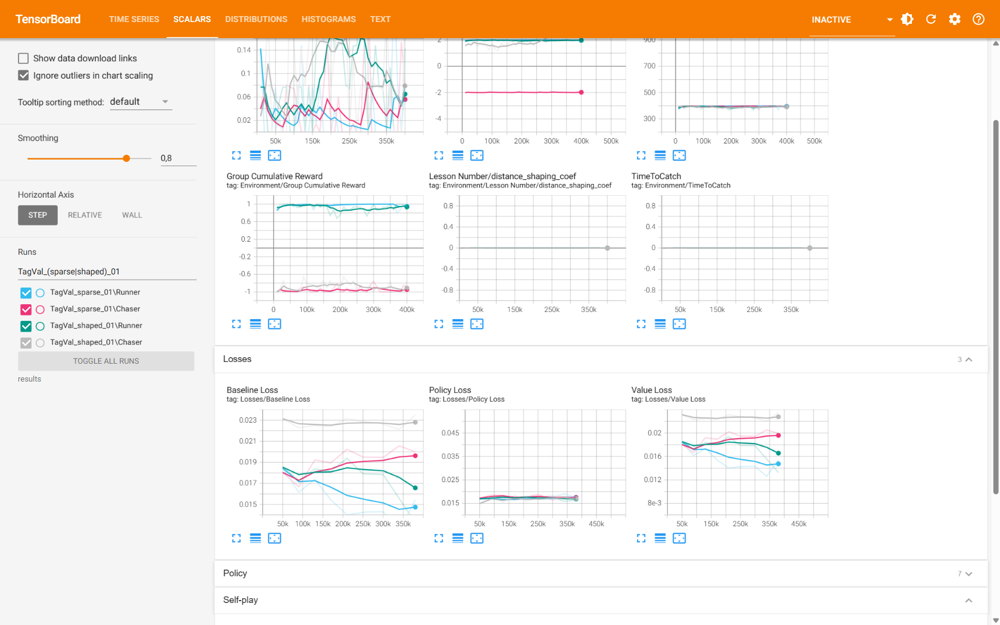
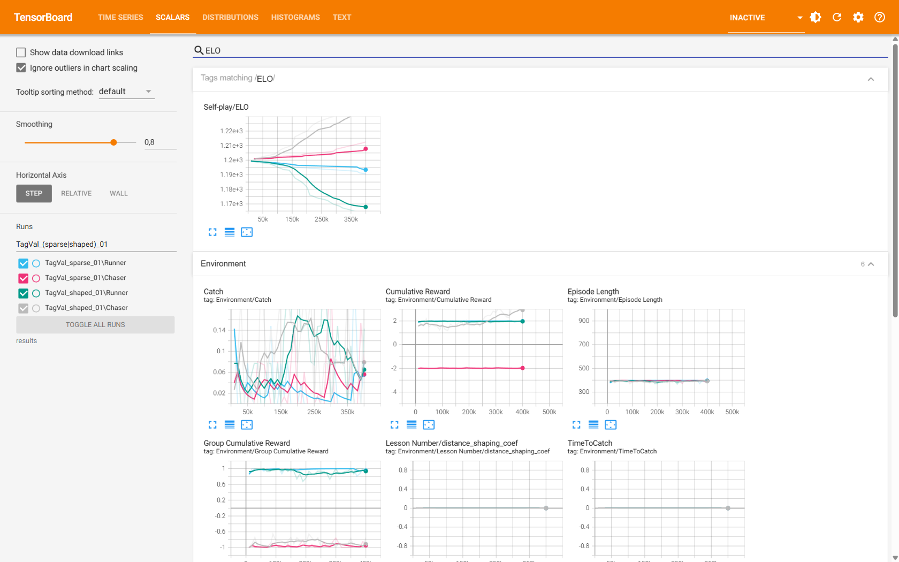
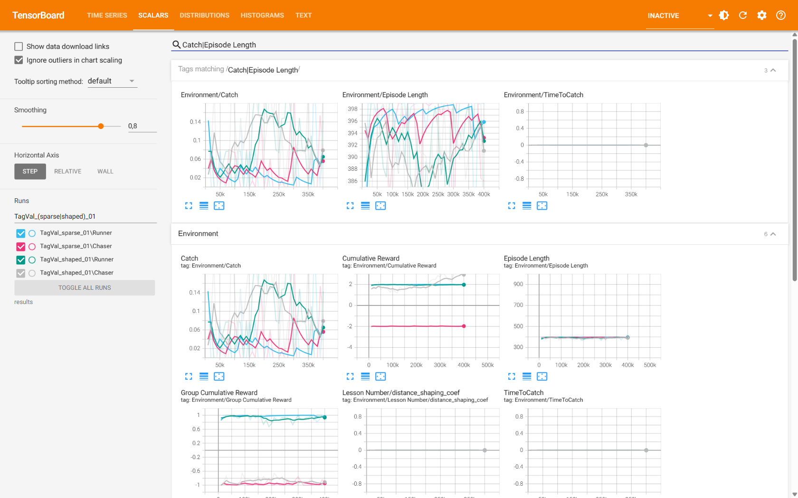
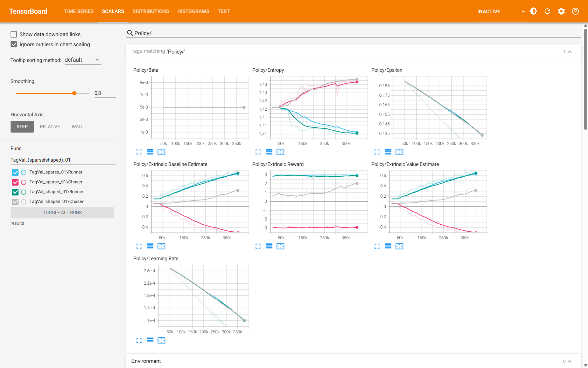

# Theory & Empirical Findings — Tag with MA-POCA

> Working notes to feed the final paper *"Analysis of Competitive Interaction in Video Games
> using Multi-Agent Machine Learning."* Each section is written so it can be lifted into the
> thesis with light editing. Findings are tagged with the run they came from.

---

## 1. Method recap (what the implementation actually instantiates)

The Tag environment is an **asymmetric two-team competitive game**:

- **Chaser** — Behavior Name `Chaser`, Team Id 0, pursues.
- **Runner** — Behavior Name `Runner`, Team Id 1, evades.

Each role is a distinct ML-Agents *behavior* and a distinct `SimpleMultiAgentGroup`. The two
groups are what make this **MA-POCA** (Multi-Agent POsthumous Credit Assignment) rather than
independent PPO: terminal team outcomes are delivered with `AddGroupReward`, and episodes end
through the group (`EndGroupEpisode` for a catch, `GroupEpisodeInterrupted` for a timeout).
MA-POCA trains a **centralized critic with a counterfactual baseline** that attributes a shared
group return to individual agents, which is the mechanism that (a) handles agents that leave/join
mid-episode ("posthumous" credit) and (b) lets the design scale to teams (e.g. a 2nd chaser)
without changing the learning rule.

Observation space: 18 vector floats (self pos/vel/forward + opponent relative pos/vel/forward)
plus a `RayPerceptionSensor3D` (walls + agents). Action space: 2 continuous (move, turn).
Decisions every 5 physics steps (`DecisionRequester` period 5). Training uses **self-play**
(ELO-rated, snapshot opponents, periodic team change).

---

## 2. Empirical evidence that the trainer is genuinely POCA (not PPO)

*Source: smoke run `TagTest_poca_01`, 2026-06-16, config `TagMApoca_smoke.yaml` (50k-step budget,
self-play cadences scaled ~100× down; CPU PyTorch 2.11.0; 4 parallel arenas).*

The distinguishing artifact is in the loss terms reported per update:

| Loss term            | Chaser  | Runner  | Interpretation |
|----------------------|---------|---------|----------------|
| `Policy/PolicyLoss`  | 0.0176  | 0.0154  | actor update (present in PPO too) |
| `Policy/ValueLoss`   | 0.0202  | 0.0201  | centralized value head |
| **`Policy/BaselineLoss`** | **0.0202** | **0.0206** | **counterfactual baseline — POCA-specific** |

> **Thesis point:** the presence of a finite **BaselineLoss** alongside ValueLoss is direct evidence
> that the centralized baseline network of MA-POCA is being optimized. A pure PPO/independent-learner
> setup reports no baseline loss. This is the cleanest single piece of evidence that the
> group-based refactor produces *bona fide* MA-POCA credit assignment.

Supporting signals (all finite, no NaN/Inf):
- **Value estimates are directionally correct.** `ExtrinsicValueEstimate` ≈ `ExtrinsicBaselineEstimate`
  = **−0.229 (Chaser)** vs **+0.042 (Runner)** — the critic already predicts the chaser loses and the
  runner roughly breaks even, consistent with the observed near-100 % runner-win baseline.
- **Entropy ≈ 1.42** for both policies — high, i.e. near-random exploration, expected at 50–60k steps.
- **Group rewards split cleanly** (`GroupCumulativeReward`: Chaser −0.66, Runner +0.85), confirming the
  group-reward plumbing reaches the optimizer.

---

## 3. Self-play machinery validated

- ELO tracked and updated from 1200: final **Chaser 1206.4 / Runner 1195.1** (~11-pt gap — noise at
  this horizon, but the rating loop works).
- `team_change` (scaled to 20k) fired: the console shows the Chaser flip to **"Not Training"** while
  the Runner kept learning — i.e. one team becomes the frozen snapshot opponent while the other trains.
- Snapshot opponents saved on `save_steps`; the agent-step counter overran the nominal budget
  (Chaser reached 60 267 > 50 000) — this is **normal self-play accounting**, not a bug: the
  non-learning ("ghost") team keeps stepping as the opponent.
- `.onnx` checkpoints exported at the checkpoint interval and the final model copied to
  `Chaser.onnx` / `Runner.onnx`. Clean, deterministic shutdown.

---

## 4. Characterization of the random-policy baseline (the "step 0" of the arms race)

At 50–60k steps the policies are still essentially random, and this defines the **initial regime**
the arms race must climb out of:

- **Mean episode length ≈ 393 / 380 decision steps** (≈ the 400-decision-step cap = 2000 physics
  steps). → **the overwhelming majority of episodes end in the stalemate timeout**, not a catch.
- **Catch rate ≈ 5–15 %** (inferred from `GroupCumulativeReward` Chaser −0.66: a pure-stalemate
  baseline would be exactly −1.0; the offset above −1 is contributed by occasional catches).
- Individual shaping behaves exactly as designed: Chaser `CumulativeReward` ≈ −1.97
  (−0.001 × ~2000 steps), Runner ≈ +1.90.

> **Thesis metric — "time-to-catch".** Mean episode length is a direct, interpretable proxy for
> chaser skill: a learning chaser should drive this curve **down** over training. Plotting mean
> episode length (and catch rate) vs. steps is a clean way to visualize the emergence of pursuit
> competence, complementing the ELO and reward curves.

---

## 5. Performance / scaling analysis (important for planning the 5M run)

Wall-clock breakdown from `timers.json` (total 396.3 s):

| Phase | Time (s) | Share | Note |
|-------|---------|-------|------|
| `env_step` (sim + IPC) | 310 | ~78 % | environment-bound |
| └ `communicator.exchange` (Unity↔Python IPC) | 168 | ~42 % | dominant single cost |
| └ `UnityEnvironment.step` | 192 | ~48 % | |
| `TorchPolicy.evaluate` (inference fwd pass) | 57 | ~14 % | |
| `TorchPOCAOptimizer.update` (gradients) | 25 | ~6 % | **the only "compute" cost** |

**Throughput:** ~109.6k agent-steps / 396 s ≈ **277 agent-steps/s** with **4 arenas** on CPU.

> **Thesis point — the bottleneck is the environment, not the network.** Only ~20 % of wall-clock is
> neural-net work (inference + gradient updates); ~80 % is Unity simulation and Python↔Unity IPC.
> **Consequences:**
> 1. A GPU would yield little speedup at this network size (256×2) — the gradient step is already
>    only ~6 % of time. *Do not* attribute slow training to "no CUDA".
> 2. The highest-leverage lever is **more parallel environments** (in-scene arenas), which both
>    raises agent-steps/s (per-step IPC overhead amortizes over more agents) and **de-correlates the
>    experience buffer** — valuable in non-stationary self-play. Currently 4 arenas; the reference
>    work (AI Warehouse) used ~200. Recommend scaling to 16–32+ before the multi-day run.
> 3. Order-of-magnitude for the planned run: 5M steps/behavior ≈ 10M agent-steps ≈ **~10 h at 4
>    arenas**; roughly inversely proportional to arena count until IPC saturates.

*Caveat:* in the smoke config the linear LR schedule is tied to `max_steps=50k`, so LR had already
decayed to ~5.3e-5 by the end. This is a smoke artifact; the real run schedules over 5M.

---

## 6. Principal risk to the research goal, and design levers

The baseline is **~100 % runner-win-by-stalemate** with a **low, sparse catch signal**, and the two
agents have **identical kinematics** (`moveSpeed 5`, `turnSpeed 180`). In pursuit-evasion theory an
equal-speed pursuer can only win in a bounded arena via interception/cornering — a hard policy to
discover from sparse reward. The chaser's only shaping today (uniform −0.001/step) creates *urgency*
but provides **no spatial gradient toward the runner**, so early learning relies on rare accidental
catches.

This mirrors the reference video's own finding: sparse rewards (their grab-the-cube event) had to be
**densified with a shaping bonus** before the behavior emerged. Candidate levers — each a thesis-worthy
design decision to **justify and ideally ablate**:

1. **Dense distance-closing reward for the chaser**, e.g. `+k · (prevDist − curDist)` per step, giving a
   smooth gradient toward the runner without changing the terminal ±1 game outcome.
2. **Slight chaser speed advantage** (e.g. 5.5–6 vs 5), a standard way to make catching achievable.
3. **Potential-based shaping** (Ng et al., 1999) so the added reward is provably policy-invariant —
   a clean, citable choice that pre-empts the "did shaping change the optimal policy?" critique.

> **Open research question for the paper:** does MA-POCA + self-play reach emergent pursuit/evasion
> under the *pure* terminal reward, or is reward shaping necessary? Running both (sparse vs shaped) is
> itself a result, not just an implementation detail.

**Decision (2026-06-17):** we adopt **option 3 (potential-based shaping)** and make the question above
the experiment itself — see §9. Lever 1 (naïve distance-delta) was rejected as not policy-invariant;
lever 2 (chaser speed advantage) is held in reserve as a documented fallback rather than a default.

---

## 7. Metrics to log for the thesis (all already emitted to TensorBoard)

- `Self-play/ELO` per behavior — divergence from 1200 = competitive separation.
- `Environment/CumulativeReward` and `Environment/GroupCumulativeReward` — opposing curves = arms race.
- **Mean episode length** (`Environment/EpisodeLength`, time-to-catch proxy) — interpretable skill metric.
- `Policy/Entropy` — exploration→exploitation transition (should fall as policies sharpen).
- `Losses/PolicyLoss`, `Losses/ValueLoss`, `Losses/BaselineLoss` — training stability; BaselineLoss
  doubles as the POCA-vs-PPO evidence (§2).
- **Custom stats (added 2026-06-17, via `StatsRecorder` in `TagArenaManager`):**
  `Environment/Catch` (1 on a catch, 0 on stalemate; averaged ⇒ **catch rate**) and
  `Environment/TimeToCatch` (arena steps at catch; averaged over catches ⇒ **mean time-to-catch**).
  These make catch rate and time-to-catch first-class TensorBoard curves rather than inferred quantities.

---

## 8. Status / next experiments

- ✅ Pipeline mechanically validated end-to-end; confirmed genuine MA-POCA.
- ✅ Reward-shaping experiment **designed + planned** (§9; spec/plan `docs/superpowers/{specs,plans}/
  2026-06-17-chaser-reward-shaping*`); arena count raised to **8** (§10).
- ✅ **400k validation arms run + analyzed (§11):** both arms learn; shaping ≈ 3× the ELO separation
  and ≈ 2.5–3× the catch rate. No fallback needed.
- ✅ `TimeToCatch` stat fixed (`090f4b5`); **headless `--no-graphics` 16-arena build** done.
- ▶ **5M rigor batch running (§12):** MA-POCA {sparse, shaped} × 3 seeds. **Sparse arm complete —
  decisive emergent chaser pursuit (ELO ≈ 1890 vs ≈ 670, Group Reward ≈ +1.45) across all 3 seeds.**
  Shaped arm in progress; full mean ± std aggregation + figures pending batch completion.
- Optional but high-value for the thesis: a **PPO (independent-learner) vs MA-POCA** comparison —
  this is what *justifies the choice* of MA-POCA rather than assuming it.

---

## 9. Designed experiment: sparse vs shaped (potential-based shaping)

To answer §6's open question rigorously we run **two arms, identical except the chaser's distance term**:

| | Sparse arm | Shaped arm |
|---|---|---|
| Terminal reward (±1 + time/survival bonus) | yes | yes |
| Chaser −0.001/step time pressure | yes | yes |
| Chaser distance shaping (PBS) | **off** (`coef = 0`) | **on** (`coef = 0.5`) |
| Kinematics (chaser/runner `moveSpeed`) | 5 / 5 | 5 / 5 |
| Observations, network, self-play, seed | identical | identical |

**Potential-based shaping (PBS), Ng, Harada & Russell (1999).** Define a potential over states
`Φ(s) = −coef · (planarDist(chaser, runner) / maxDist)` (closer ⇒ higher), and add to the chaser at
each step `F = γ·Φ(s′) − Φ(s)` with `γ = 0.99` (the trainer's discount). `maxDist` ≈ 28 (arena
diagonal); `coef = 0.5` keeps the telescoped shaping below the ±1 terminal magnitude.

> **Why PBS is the right choice for the thesis.** PBS is *policy-invariant*: adding `F` does not change
> the optimal policy of the underlying MDP — only the speed of learning. So if the shaped arm learns
> pursuit and the sparse arm does not (or does so far slower), the conclusion is **"shaping improved
> sample efficiency, not the target behavior"** — the emergence claim survives, and the "did you just
> engineer the behavior?" critique is pre-empted by construction. (The multi-agent self-play setting
> weakens the single-agent invariance theorem somewhat, but the argument and citation remain the
> standard, defensible framing.)

**Success rule (pre-registered).** An arm counts as *learning* only if, by 400k steps, **catch rate
rises above the ~15 % random baseline AND mean episode length falls below ~393 decision steps AND ELO
diverges from 1200 in opposing directions**. If both arms stay flat near baseline, re-run with a **6/5
chaser speed edge** (documented fallback); a persistent stall under equal speed is itself a reportable
result about the difficulty of equal-speed pursuit.

**Reproducibility.** The arm is selected entirely from the trainer config
(`environment_parameters.distance_shaping_coef`), not a hand-set Editor field, and both configs are
archived in `experiments/configs/`.

---

## 10. Parallelism & hardware (validation setup)

**Hardware (training laptop):** Intel i7-9750H (6 cores / 12 threads), 16 GB RAM, NVIDIA GTX 1660 Ti
(4 GB) + Intel UHD 630.

Combined with the §5 finding that the workload is **environment/IPC-bound, not compute-bound**:

- **The GPU is effectively irrelevant** for this project. PyTorch is the CPU build, the network is tiny
  (256×2), and gradient updates are ~6 % of wall-clock. Slow training must not be blamed on "no CUDA".
- **Arena count raised 4 → 8 → 16** (held constant across runs so it does not confound comparisons).
  On a 6c/12t CPU training *in the Editor* the main thread eventually saturates. **Measured bake-off
  (50k smoke, in-Editor):** 12 arenas = **495 agent-steps/s**, 16 arenas = **553 steps/s** (+12%), but
  per-arena efficiency fell (41 → 35 steps/s/arena) — i.e. approaching the saturation knee. **16 chosen.**
  Caveat: measured in-Editor (with rendering); the **headless build frees rendering CPU**, so its knee
  sits higher — re-measuring ≥16 against the headless build may justify going further.
  Run-time at 16 (in-Editor): a 5M-per-behavior run ≈ ~5 h; headless ≈ ~2.5–3 h.
- **Cross-arena spacing constraint:** arenas must sit **≥35 u apart** (centres). The raycast sensor
  length is 10 u and each arena is 20×20 (half-width 10 u), so centres closer than ~30 u let an agent's
  rays or physics collider reach a neighbour arena → phantom observations or false catches. The 8 copies
  are laid out on the X axis at ≥35 u spacing, all at z = 0.
- **Biggest lever for the multi-day 5M run is *not* more in-Editor arenas — it is not rendering.**
  Building a **headless standalone and training against it with `--no-graphics`** removes per-frame
  render cost and enables true multi-process parallelism (`--num-envs`) across the CPU cores. This is
  flagged as its own task before the 5M run.

---

## 11. Validation results — sparse vs shaped, 400k steps

Both arms (`TagVal_sparse_01`, coef 0; `TagVal_shaped_01`, coef 0.5) ran 400k steps, **same seed
12345**, 8 arenas, identical except the chaser distance-shaping term. ELO and the `Lesson Number/
distance_shaping_coef` curve confirm the arm was correctly selected from config (coef held at 0.0 vs
0.5 throughout). POCA confirmed in both (finite `Losses/Baseline Loss`).

### Headline numbers (final-window values)

| Metric (Chaser unless noted) | Sparse (coef 0) | Shaped (coef 0.5) | Reading |
|---|---|---|---|
| Self-play/ELO — Chaser | 1212.6 | **1236.4** | shaped chaser pulls further ahead |
| Self-play/ELO — Runner | 1190.7 | **1163.7** | shaped runner pushed further down |
| **ELO gap (Chaser−Runner)** | **+21.9** | **+72.7** | **shaping ≈ 3× the competitive separation** |
| Environment/Catch (catch rate) | ~0.08 | **~0.21** | shaping ≈ 2.5–3× the catch rate |
| Environment/Episode Length | 386 | **374** | shaped catches sooner (lower = better; both still near the 400-cap) |
| **Group Cumulative Reward — Chaser** | **−0.91** | **−0.75** | true game outcome (shaping-independent) — shaped chaser loses less |
| Group Cumulative Reward — Runner | +0.94 | +0.86 | shaped runner wins less, consistent |
| Cumulative Reward — Chaser (individual) | −1.94 (pinned ≈ −2) | +2.78 (rising) | shaped chaser is actively closing distance (incl. shaping term — see caveat) |
| Policy/Entropy | ~1.43 | ~1.43 | both still high — neither policy has converged at 400k |

### Figures (TensorBoard, smoothing 0.8; blue/cyan = Chaser, red/pink = Runner; brighter = shaped)

*Fig. 1 — Overview of all logged scalars for both arms (validation runs only).*

*Fig. 2 — `Self-play/ELO`. Both arms diverge from 1200 in opposing directions; the shaped arm's chaser
rises higher (~1236) and its runner falls lower (~1164), i.e. a markedly larger competitive gap.*

*Fig. 3 — `Environment/Catch` (catch rate) and `Environment/Episode Length` (time-to-catch proxy). The
shaped arm sustains a higher catch rate and a lower episode length than the sparse arm.*

*Fig. 4 — Policy group (per behavior, both arms): `Entropy` stays high (~1.40–1.43, policies not yet
converged at 400k); `Extrinsic Value Estimate` and `Extrinsic Baseline Estimate` diverge (chaser
negative, runner positive — the critic correctly predicts who is winning); `Learning Rate` decays
linearly; `Epsilon` decays; `Beta` constant — i.e. the optimizer schedules behaved as configured.*

### Interpretation

1. **Neither arm is flat at the random baseline → no 6/5 fallback needed.** Both show the chaser
   improving (ELO up, catch rate up, episode length down) — so even the *pure terminal reward* (sparse
   arm) begins to produce pursuit under MA-POCA + self-play at equal speed. That directly answers the
   research question's first half: emergence does start without shaping.
2. **Shaping substantially accelerates learning** — ~3× the ELO separation, ~2.5–3× the catch rate, and
   a lower episode length at the same step budget. This is the expected PBS effect: faster learning, and
   (by the policy-invariance argument, §9) the *same* target behavior — so the emergence claim survives.
3. **The cleanest, shaping-independent evidence is `Group Cumulative Reward`** (the ±1 game outcome +
   bonuses, identical in both arms and *not* affected by the shaping term): the shaped chaser improved to
   −0.75 vs the sparse chaser's −0.91. So shaping produced **genuinely more wins**, not merely larger
   reward numbers from the extra term.

### Caveats (for honest reporting)

- **400k is short.** Both policies are still near the baseline regime in absolute terms (episode length
  still close to the 400-cap, catch rate < 25 %, entropy still ~1.43). This run **validates the pipeline
  and the shaping benefit and justifies the 5M run** — it does **not** show solved/emergent advanced
  tactics yet.
- **`Cumulative Reward` is not comparable across arms** (the shaped arm's individual reward includes the
  shaping term). Use `Group Cumulative Reward`, ELO, catch rate, and episode length for cross-arm claims.
- **γ < 1 weakens strict PBS invariance.** With `F = γΦ′−Φ` and a persistently negative Φ, the discount
  introduces a small standing per-step reward for *being* close (not only for closing). The effect is
  minor at γ = 0.99, but it means "policy-invariant" holds approximately, not exactly — worth stating in
  the thesis rather than overclaiming.
- **`Environment/TimeToCatch` logged all-zeros in these 400k runs** — a stat bug: it was recorded
  *after* `EndGroupEpisode()`, which synchronously runs the chaser's `OnEpisodeBegin → ResetArena` and
  zeroes `stepCount`. **Fixed 2026-06-20** (commit `090f4b5`: stats now recorded before the group-end
  call) and **verified** (a 50k smoke after the fix logged plausible nonzero catch times ~290–585
  physics steps). The 400k validation data above keeps Episode Length as its time-to-catch proxy; the
  5M rigor runs will have a working `TimeToCatch`.

### Verdict

Pipeline + experiment design validated; **shaping clearly helps and the sparse arm also learns**. Next:
fix the `TimeToCatch` stat, then scale up (headless build, §10) and run the long (multi-M) comparison —
optionally adding seeds for variance bars and the PPO-vs-MA-POCA arm (§8).

---

## 12. 5M rigor runs — preliminary result (batch in progress, 2026-06-21)

The overnight batch (`experiments/run_overnight_poca.bat`, headless `--no-graphics`, **16 arenas**)
runs the full rigor matrix: **MA-POCA {sparse, shaped} × 3 seeds**, each **5M steps/behavior**, on the
headless standalone. Throughput held at ~**300 training-behavior steps/s** (≈ 600 agent-steps/s across
both teams) ⇒ **~4.6 h per run**.

**Status at time of writing:** sparse arm **complete (3 seeds)**; shaped arm **running** (seed 1 ≈ 36 %,
seeds 2–3 queued). The numbers below are read from the **training console logs** (per-behavior, single
seed each) and are a strong *preliminary* signal — the **final, thesis-grade analysis** (mean ± std
across the 3 seeds, catch-rate / episode-length / ELO curves with error bands, sparse-vs-shaped figures)
is produced once the batch finishes and is aggregated from the TensorBoard event files.

### Headline — the sparse arm produces decisive, emergent pursuit at 5M

This is the **direct answer to the research question's first half**: under the **pure terminal reward**
(no distance shaping, equal 5/5 kinematics), MA-POCA + self-play **does** produce a competent chaser —
and the result is **consistent across all three seeds**.

| Sparse run (final, 5M) | Training behavior shown | ELO | Mean Group Reward | Reading |
|---|---|---|---|---|
| `POCA_sparse_s1` | Chaser | **1890.7** | **+1.45** | chaser catches, and catches *fast* (Group Reward > +1 ⇒ large time-bonus) |
| `POCA_sparse_s2` | Runner | **685.5** | −0.87 | runner is losing ⇒ chaser dominates |
| `POCA_sparse_s3` | Runner | **661.1** | −0.94 | runner is losing ⇒ chaser dominates |

- **ELO separation of ≈ 1200 points** in the chaser's favor (chaser ≈ 1890 vs runner ≈ 660–690),
  versus the ~22-point gap at the 400k validation horizon (§11). The arms race resolved **emphatically
  toward the chaser** over the full run.
- **`Mean Group Reward ≈ +1.45` for the chaser** (s1) is the shaping-independent game outcome: not just
  "catches more often" but "catches **early**", since the terminal reward is `+1 + timeBonus` (timeBonus
  up to +0.5 for fast catches). A mean of +1.45 implies most episodes end in a **fast** catch.
- **Reproduced across 3 seeds** — the chaser wins in every seed (directly in s1; via the runner's
  strongly negative Group Reward in s2/s3). This is exactly the variance check (§ "seed aggregation")
  that single-seed RL claims lack.

> **Thesis framing.** At 400k (§11) the honest verdict was "both arms begin to learn; shaping helps;
> not yet emergent." At **5M the sparse arm has crossed into clearly emergent pursuit** — strong enough
> that the open question flips from *"does it emerge?"* (yes) to *"how much does shaping accelerate /
> change it, and does the runner ever recover a counter-strategy with more training?"* The shaped-arm
> seeds (running now) will let us state the shaping effect at 5M with seed variance, not just at 400k.

### Caveats (before quoting these in the thesis)

- **Console figures are per-behavior and single-seed.** The table reports whichever team was *Training*
  at the final log line; ELO is robust, but **catch rate, episode length, and cross-seed mean ± std must
  come from the aggregated TensorBoard data**, not these lines. Treat §12 as preliminary until the batch
  completes and is aggregated.
- **The shaped arm is not yet in.** No sparse-vs-shaped 5M claim can be made until shaped seeds 1–3
  finish. Early shaped_s1 logs (≈1.8M) showed the chaser still mid-climb (high PBS reward, Group Reward
  not yet positive) — consistent with shaping front-loading distance-closing before catches consolidate;
  judge it from the final curves.
- **`Self-play/ELO` scale is not absolute.** A ~1890 vs ~670 split shows a large *relative* skill gap,
  not an externally calibrated rating; report it as divergence from the 1200 start, as in §11.

### What gets added here when the batch finishes

1. Aggregated **mean ± std across 3 seeds per arm** for ELO, catch rate, episode length, group reward.
2. **Sparse-vs-shaped 5M figures** with error bands (the seed-aggregation script).
3. A working **`Environment/TimeToCatch`** curve (the stat bug was fixed pre-run, §11 caveat / `090f4b5`).
4. Final **verdict on the shaping effect at scale** and whether the runner re-develops a counter.
